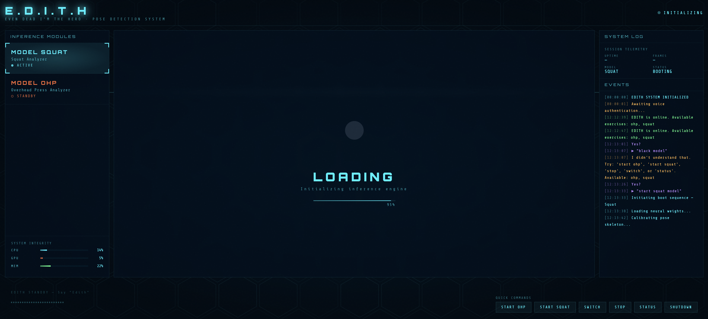
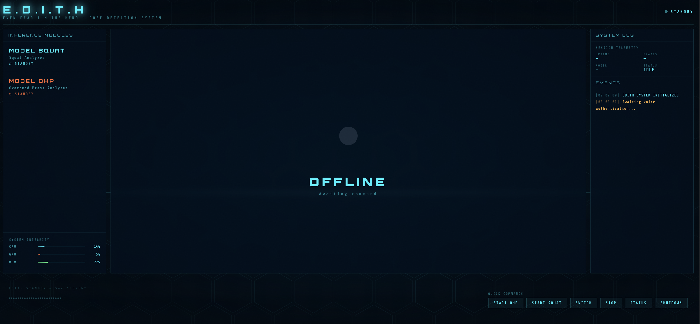
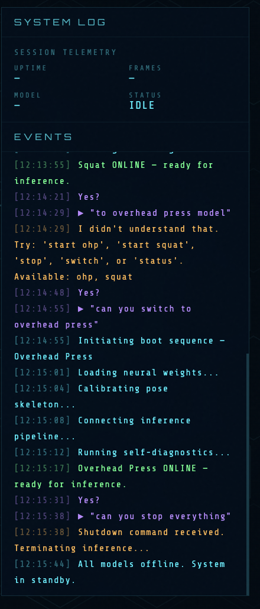

# E.D.I.T.H 🤖

> **E**xercise **D**iagnostic and **I**nference **T**raining **H**ub  
> A real-time AI gym-form coach with a voice-first interface.


---

## What is EDITH?

EDITH is a browser-based HUD (Heads-Up Display) that wraps a machine-learning pose-analysis pipeline and exposes it through a conversational, voice-activated interface. Say its name, give a command, and it loads the correct neural network, opens your camera, and streams annotated form-feedback frames back to the dashboard in real time.

---

## How does it work?

EDITH uses a two-phase voice loop running entirely on the backend:

1. **Wake** — say "Edith" (or "Hey Edith", "Yo Edith" — any phrase containing the word)
2. **Respond** — it answers "Yes?" through your speakers
3. **Command** — speak your intent naturally

| Command           | Example phrase                        |
| ----------------- | ------------------------------------- |
| Start an exercise | "start overhead press", "start squat" |
| Check status      | "what's running", "status"            |
| Switch exercise   | "switch", "change to squat"           |
| Stop              | "stop", "that's enough"               |
| Shutdown          | "shutdown", "goodbye"                 |

---

## Supported Exercises

| Exercise           | Voice aliases                                         | Errors detected                   |
| ------------------ | ----------------------------------------------------- | --------------------------------- |
| **Overhead Press** | "ohp", "overhead press", "shoulder press", "overhead" | Elbow position, knee compensation |
| **Squat**          | "squat", "squats", "back squat", "back squats"        | Shallow depth, lumbar rounding    |

> New exercises can be registered in `gym-form/src/control/model_registry.py` without modifying any other backend code.

---

## Project Structure

```
Fitness/
├── gym-form/        ← ML library: predictors, model registry, voice I/O
└── edith/
    ├── backend/     ← FastAPI server: WebSocket, intent parser, voice loop
    └── frontend/    ← React HUD: panels, hooks, live camera feed
```

---

## Prerequisites

- **macOS** (TTS playback uses `afplay`)
- **Python 3.14** — managed via the `gym-form/.venv` virtual environment
- **Node 20+**
- A working **microphone** (for wake-word and command capture)
- A connected **webcam**

---

## Quick Start

```bash
# 1. Activate the shared virtual environment
source gym-form/.venv/bin/activate

# 2. Backend (terminal 1)
cd edith/backend
uvicorn main:app --reload --port 8000

# 3. Frontend (terminal 2)
cd edith/frontend
npm install      # first time only
npm run dev      # opens at http://localhost:5173
```

Then just say **"Edith"** and give a command.

---

## Known Limitations

- TTS playback (`afplay`) is macOS-only — Linux/Windows would need a different audio player
- Wake-word detection requires a quiet environment for best accuracy
- Camera and mic must be available and not in use by another application

---

## Documentation

Full architectural docs live in [`edith/docs/`](edith/docs/README.md):

- [Architecture Overview](edith/docs/ARCHITECTURE.md) — system diagram, technology choices, connectivity
- [Backend](edith/docs/BACKEND.md) — FastAPI structure, services, gym-form integration
- [Frontend](edith/docs/FRONTEND.md) — React component tree, hooks, state machine
- [Voice Pipeline](edith/docs/VOICE-PIPELINE.md) — wake-word flow, TTS, concurrency model
- [Data Flow](edith/docs/DATA-FLOW.md) — WebSocket protocol, message schemas, event lifecycle

## Presentation




